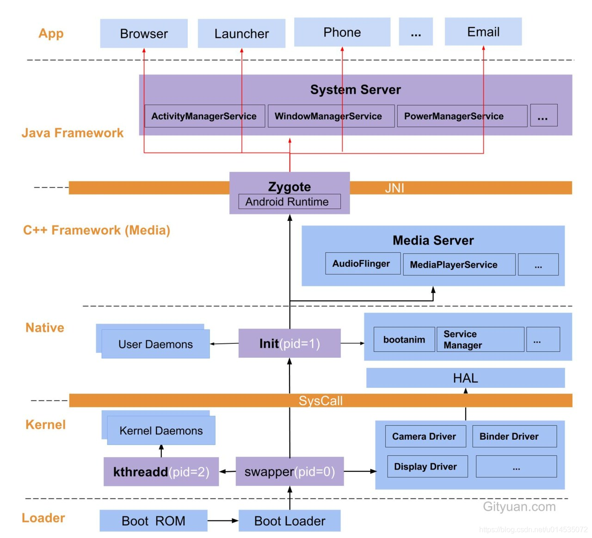

---
tags:
  - Android系统
  - MOC
---

# Android 启动流程

> 从按下电源键到 Launcher 显示，Android 启动经过 **BootROM → Bootloader → Kernel → [[Init 进程|Init]] → [[Zygote 进程|Zygote]] → [[SystemServer 启动|SystemServer]] → Launcher**。本文是整个启动链路的导航页。



## 启动阶段

1. **Kernel** — 内核启动，初始化硬件，挂载根文件系统，最终执行 `/init`（TODO）
2. **[[Init 进程]]** — 用户空间第一个进程（PID 1），解析 init.rc，拉起 [[ServiceManager自举原理|ServiceManager]] 和 [[Zygote 进程|Zygote]]
3. **[[Zygote 进程]]** — 所有 Java 进程的父进程，预加载 Framework 资源，fork 出 [[SystemServer 启动|SystemServer]]
4. **[[SystemServer 启动]]** — 分三批启动 AMS、PMS、WMS 等所有 Java 层系统服务

ServiceManager 的启动时机特殊：它在 Init 阶段就被拉起，比 Zygote 更早。[[ServiceManager自举原理|ServiceManager 不是被注册的，而是被 Binder 驱动钦点的]]——固定句柄 0，驱动级保证排他。

## 完整调用链（白板手撕版）

```
[Kernel] → exec /init (PID 1)

[Init]
  FirstStage → 挂载文件系统、加载内核模块
  SetupSelinux → 启用 SELinux
  SecondStage → 解析 init.rc
    → 启动 ServiceManager (Binder 句柄 0)
    → 启动 Zygote (socket 等待 fork 指令)

[Zygote]
  app_process → 创建 JVM
  ZygoteInit → 预加载 Framework 资源
    → fork SystemServer

[SystemServer]
  startBootstrapServices → AMS, PMS, ATMS
  startCoreServices → Battery, UsageStats
  startOtherServices → WMS, Input, Audio
  → Looper.loop() (永不返回)

[Launcher] ← AMS 通过 Intent 启动
```
