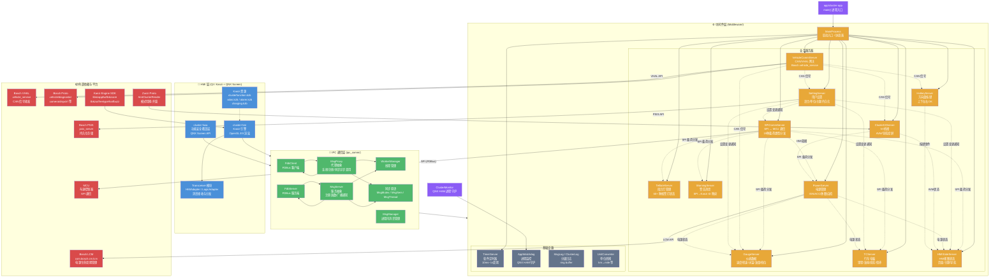

```mermaid
graph TB
    subgraph HMI["🎨 HMI 层 (Qt / Kanzi + QNX Screen)"]
        HMI_Kanzi["cluster-hmi<br/>Kanzi 引擎<br/>OpenGL ES 渲染"]
        HMI_Fusa["cluster-fusa<br/>功能安全覆盖层<br/>QNX Screen API"]
        HMI_KZB["Kanzi 资源<br/>clusterfunction.kzb<br/>adas.kzb / alarm.kzb<br/>charging.kzb"]
        Transceiver["Transceiver 模块<br/>HMIAdapter / LogicAdapter<br/>消息接收与分发"]
    end

    subgraph IPC["🔗 IPC 通信层 (ipc_comm/)"]
        FdbClient["FdbClient<br/>FDBus 客户端"]
        FdbServer["FdbServer<br/>FDBus 服务端"]
        MsgProxy["MsgProxy<br/>代理抽象<br/>连接/注册/同步异步调用"]
        MsgServer["MsgServer<br/>服务抽象<br/>注册函数/广播通知"]
        MsgManager["MsgManager<br/>进程内消息管理"]
        WorkerManager["WorkerManager<br/>线程管理"]
        SyncPrim["同步原语<br/>MsgMutex / MsgSem / MsgThread"]
    end

    subgraph Middleware["⚙️ 中间件层 (Middleware/)"]
        direction TB
        MainProcess["MainProcess<br/>启动入口 / 协调器"]
        
        subgraph Servers["业务服务器"]
            SPIComm["SPICommServer<br/>SPI ↔ MCU 通信<br/>19种载荷类型分发"]
            VehicleComm["VehicleCommServer<br/>CAN/VHAL 网关<br/>Bosch vehicle_service"]
            Gauge["GaugeServer<br/>仪表数据<br/>速度/转速/水温/油量/档位"]
            Telltale["TelltaleServer<br/>指示灯管理<br/>60+ 种报警灯状态"]
            Warning["WarningServer<br/>警告消息<br/>SPI→Kanzi ID 映射"]
            TCServer["TCServer<br/>行车电脑<br/>里程/油耗/续航/保养"]
            Setting["SettingServer<br/>用户设置<br/>语言/单位/主题持久化"]
            Power["PowerServer<br/>电源管理<br/>IGN/ACC/休眠/自检"]
            HMIState["HMIStateServer<br/>HMI视图状态<br/>页面/主题/导航"]
            ClusterIVI["ClusterIVIServer<br/>IVI桥接<br/>AVM/导航投屏"]
            Hotkey["HotkeyServer<br/>方向盘按键<br/>上下左右OK"]
        end
        
        subgraph Infrastructure["基础设施"]
            TimerServer["TimerServer<br/>软件定时器<br/>10ms~1s周期"]
            AppWatchdog["AppWatchdog<br/>进程监控<br/>QNX HAM守护"]
            Logger["MsgLog / ClusterLog<br/>分级日志<br/>ring buffer"]
            Utils["UnitConverter<br/>单位转换<br/>km↔mile 等"]
        end
    end

    subgraph External["📦 外部依赖与平台"]
        BoschVHAL["Bosch VHAL<br/>vehicle_service<br/>CAN 信号收发"]
        BoschLCM["Bosch LCM<br/>com.bosch.cm.lcm<br/>电源生命周期管理"]
        BoschPSIS["Bosch PSIS<br/>psis_server<br/>持久化存储"]
        BoschProto["Bosch Proto<br/>vehicle/diagnostic/<br/>camera/dispctrl 等"]
        ZunziProto["Zunzi Proto<br/>AmtClusterRender<br/>模式切换/开窗"]
        MCU["MCU<br/>车身控制器<br/>SPI 通信"]
        KanziEngine["Kanzi Engine SDK<br/>libkzappfw/libkzcore<br/>libkzui/freetype/harfbuzz"]
    end

    app["app/cluster-app<br/>main() 进程入口"]
    app_monitor["ClusterMonitor<br/>QNX HAM 进程守护"]

    %% HMI 到 IPC 的连接
    HMI_Kanzi --> Transceiver
    HMI_Kanzi --> IPC
    HMI_Fusa --> IPC
    HMI_KZB -.-> HMI_Kanzi

    %% IPC 层内部连接
    FdbClient --> MsgProxy
    FdbServer --> MsgServer
    MsgProxy --> FdbClient
    MsgServer --> FdbServer
    MsgProxy --> WorkerManager
    MsgServer --> WorkerManager
    MsgProxy --> SyncPrim
    MsgServer --> SyncPrim

    %% IPC 到中间件
    IPC --> Middleware

    %% app 入口
    app --> MainProcess
    app_monitor --> AppWatchdog

    %% 中间件内部
    MainProcess --> SPIComm
    MainProcess --> VehicleComm
    MainProcess --> Gauge
    MainProcess --> Telltale
    MainProcess --> Warning
    MainProcess --> TCServer
    MainProcess --> Setting
    MainProcess --> Power
    MainProcess --> HMIState
    MainProcess --> ClusterIVI
    MainProcess --> Hotkey
    MainProcess --> TimerServer

    %% 服务器之间的数据流
    SPIComm -.->|"SPI 载荷分发"| Power
    SPIComm -.->|"SPI 载荷分发"| Gauge
    SPIComm -.->|"SPI 载荷分发"| Telltale
    SPIComm -.->|"SPI 载荷分发"| Warning
    SPIComm -.->|"SPI 载荷分发"| TCServer
    SPIComm -.->|"SPI 载荷分发"| HMIState

    VehicleComm -.->|"CAN 信号"| Gauge
    VehicleComm -.->|"CAN 信号"| Hotkey
    VehicleComm -.->|"CAN 信号"| Setting
    VehicleComm -.->|"CAN 信号"| ClusterIVI

    Setting -.->|"设置变更通知"| Gauge
    Setting -.->|"设置变更通知"| TCServer
    Setting -.->|"设置变更通知"| SPIComm
    Setting -.->|"设置变更通知"| HMIState

    Power -.->|"电源状态"| Gauge
    Power -.->|"电源状态"| TCServer
    Power -.->|"电源状态"| HMIState

    ClusterIVI -.->|"HMI就绪"| Power
    ClusterIVI -.->|"AVM状态"| HMIState
    
    Hotkey -.->|"按键事件"| HMIState

    %% 外部连接
    SPIComm -->|"SPI (FDBus)"| MCU
    VehicleComm -->|"VHAL API"| BoschVHAL
    Power -->|"LCM API"| BoschLCM
    Setting -->|"PSIS API"| BoschPSIS
    VehicleComm --> BoschProto
    ZunziProto --> ClusterIVI
    KanziEngine --> HMI_Kanzi

    %% 样式
    classDef accent0 fill:#4a90d9,color:#fff
    classDef accent1 fill:#50b86c,color:#fff
    classDef accent2 fill:#e8a838,color:#fff
    classDef accent3 fill:#d94a4a,color:#fff
    classDef accent4 fill:#8b5cf6,color:#fff
    classDef accent5 fill:#06b6d4,color:#fff
    classDef accent6 fill:#64748b,color:#fff
    classDef accent7 fill:#ec4899,color:#fff

    class HMI_Kanzi,HMI_Fusa,HMI_KZB,Transceiver accent0
    class FdbClient,FdbServer,MsgProxy,MsgServer,MsgManager,WorkerManager,SyncPrim accent1
    class MainProcess,SPIComm,VehicleComm,Gauge,Telltale,Warning,TCServer,Setting,Power,HMIState,ClusterIVI,Hotkey accent2
    class TimerServer,AppWatchdog,Logger,Utils accent6
    class BoschVHAL,BoschLCM,BoschPSIS,BoschProto,ZunziProto,MCU,KanziEngine accent3
    class app,app_monitor accent4
```

